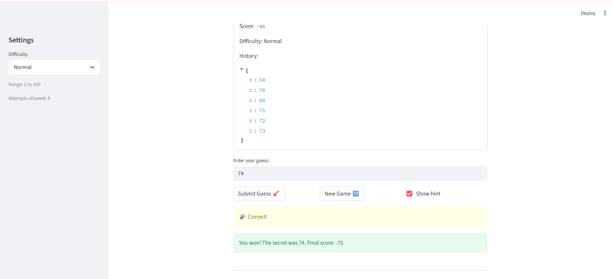

# 🎮 Game Glitch Investigator: The Impossible Guesser

## 🚨 The Situation

You asked an AI to build a simple "Number Guessing Game" using Streamlit.
It wrote the code, ran away, and now the game is unplayable. 

- You can't win.
- The hints lie to you.
- The secret number seems to have commitment issues.

## 🛠️ Setup

1. Install dependencies: `pip install -r requirements.txt`
2. Run the broken app: `python -m streamlit run app.py`

## 🕵️‍♂️ Your Mission

1. **Play the game.** Open the "Developer Debug Info" tab in the app to see the secret number. Try to win.
2. **Find the State Bug.** Why does the secret number change every time you click "Submit"? Ask ChatGPT: *"How do I keep a variable from resetting in Streamlit when I click a button?"*
3. **Fix the Logic.** The hints ("Higher/Lower") are wrong. Fix them.
4. **Refactor & Test.** - Move the logic into `logic_utils.py`.
   - Run `pytest` in your terminal.
   - Keep fixing until all tests pass!

## 📝 Document Your Experience

- [X] Describe the game's purpose.
The purpose of the game is to be a fun guessing game. You are given 7 tries to guess a number between 1 and 100. You can get hints and restart the game if stuck.
- [X] Detail which bugs you found.
I found 3 total bugs: wrong hints, unable to restart game, no input validation.

- [X] Explain what fixes you applied.
I used copilot to fix the bugs. I refactored 2 functions from app.py into logic_utils.py. I fixed the logic in the function for the hints since the logic was reversed. I reset state properly so that new game worked. I added input validation so that only correct input between 1 and 100 was accepted.

## 📸 Demo

- [X] [Insert a screenshot of your fixed, winning game here]

## 🚀 Stretch Features

- [ ] [If you choose to complete Challenge 4, insert a screenshot of your Enhanced Game UI here]
